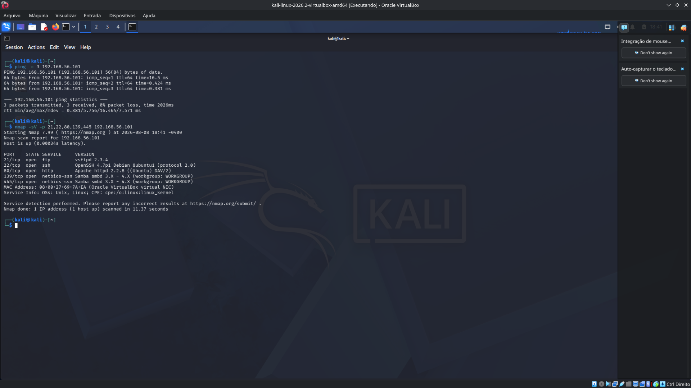
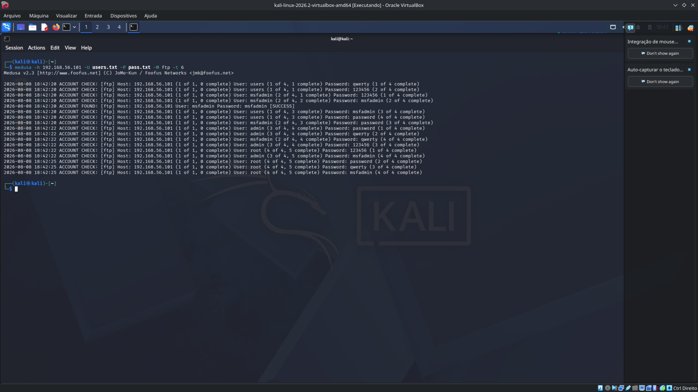
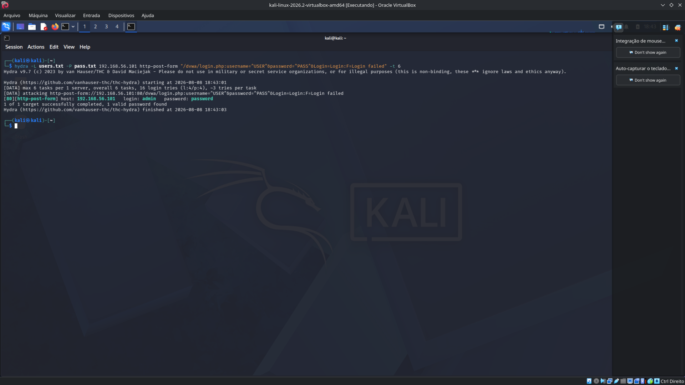
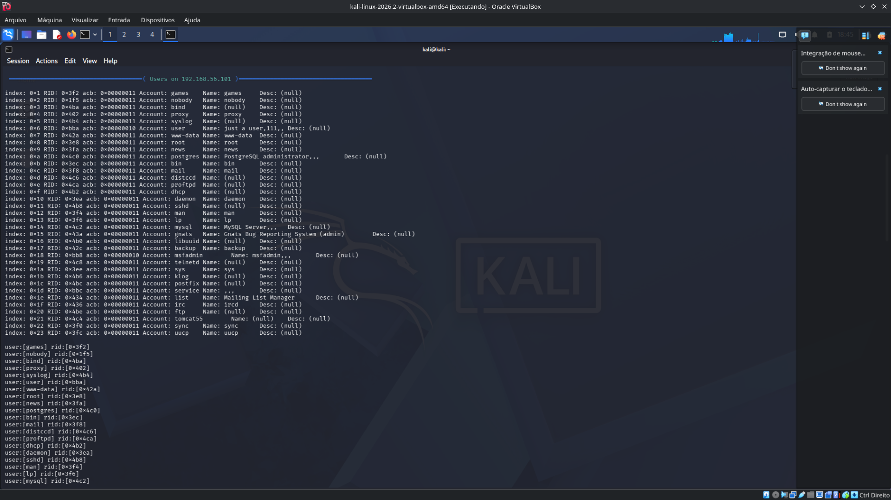
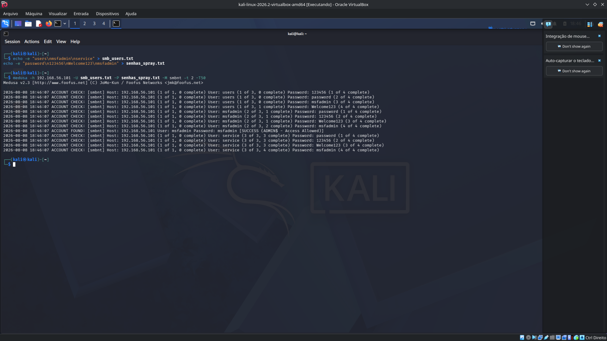
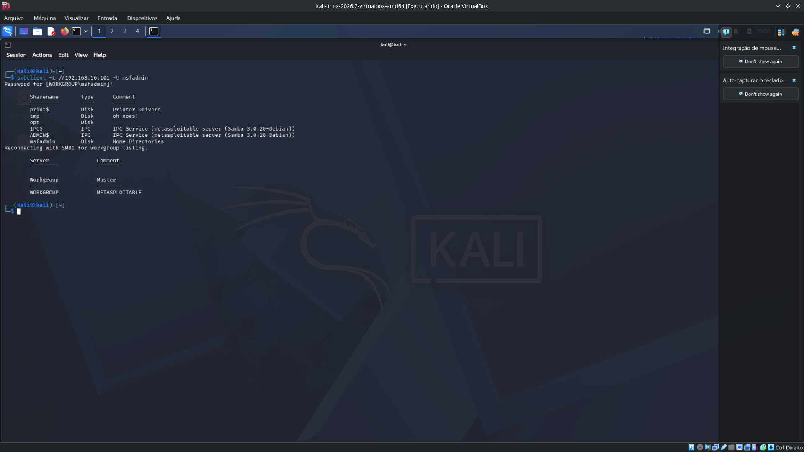

# 🛡️ Auditoria de Autenticação: Força Bruta e Password Spraying

## 🎯 Sobre o Projeto
Este laboratório prático foi desenvolvido como parte do desafio da **DIO**. O objetivo é simular, documentar e mitigar ataques de força bruta e *password spraying* em um ambiente corporativo isolado, explorando serviços de rede e aplicações web vulneráveis.

## 🛠️ Ambiente e Ferramentas
* **Atacante:** Kali Linux (Máquina Virtual)
* **Alvo:** Metasploitable 2 (Máquina Virtual - IP: `192.168.56.101`)
* **Rede:** VirtualBox Host-Only (Isolada)
* **Ferramentas:** `nmap`, `medusa`, `hydra`, `enum4linux`, `smbclient`

---

## 🚀 Execução dos Ataques e Evidências

### 1. Mapeamento Inicial da Rede
O primeiro passo foi identificar portas abertas e validar a conexão com o alvo utilizando o `ping` e o `nmap`.

### 2. Força Bruta em Serviço FTP
Foi realizado um ataque de dicionário direto contra a porta 21 (FTP) utilizando o **Medusa** e wordlists customizadas.

*Credencial `msfadmin:msfadmin` identificada com sucesso.*

### 3. Automação em Formulário Web (DVWA)
O alvo foi o painel de login do *Damn Vulnerable Web Application* (DVWA). Após inspecionar o *payload* da requisição POST HTTP no navegador, o ataque foi executado com o **Hydra**.

*Credenciais de administrador web descobertas.*

### 4. Ataque em Cadeia: Enumeração SMB e Password Spraying
Em vez de atacar um único usuário (o que causaria bloqueio de conta), simulamos um ataque furtivo em etapas.

**Fase A: Enumeração via Sessão Nula**
Utilizando o `enum4linux`, foi possível extrair a lista real de usuários do sistema sem necessidade de autenticação prévia.

**Fase B: Preparação e Spraying**
Com a lista real em mãos, o Medusa testou uma única senha comum contra diversos usuários para evitar o bloqueio (*Account Lockout*).

*Credencial administrativa identificada no compartilhamento ADMIN$.*

**Fase C: Validação de Acesso**
Com o sucesso do *spraying*, o acesso administrativo ao compartilhamento foi validado através do comando `smbclient`.

---

## 🛡️ Medidas de Mitigação e Prevenção

Do ponto de vista de defesa corporativa, os ataques documentados poderiam ser evitados com as seguintes implementações:

1. **Gestão de Identidade e Acesso:** Implementar políticas rigorosas de bloqueio de conta (*Account Lockout*) após múltiplas tentativas falhas de login.
2. **Proteção de Protocolos Legados:** Desabilitar permissões de *Null Sessions* no protocolo SMB, impedindo que usuários anônimos consigam enumerar a base de dados do sistema.
3. **Segurança em Aplicações Web:** Adotar mecanismos anti-automação (como CAPTCHAs) e validar rigorosamente tokens CSRF em todos os formulários.
4. **Educação e Conscientização:** A eficácia do *Password Spraying* baseia-se no erro humano. Treinamentos corporativos sobre segurança da informação são essenciais para evitar o uso de senhas previsíveis.
